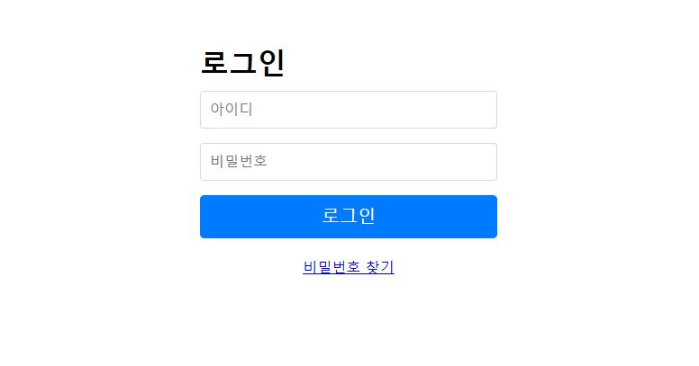

# spring-webboard
스프링부트로 구축한 기본 사이트
<br/><br/>
## SKILL
* 개발도구 : IntelliJ
* Java : jdk 1.8
* Framework : SpringBoot 2.2
* Build : Gradle 5.6
* In-Memory DB : [H2](https://blog.naver.com/myh814/221684433033)
* Mapper : mybatis
* Front-end : [jsp](https://blog.naver.com/myh814/221684419549), [bootstrap admin](https://startbootstrap.com/templates/sb-admin/)
<br/><br/>

<hr/>
<br/>

## [ERD](src/main/resources/schema.sql)

(Change column name of BOARD TABLE form "NAME" to "BOARD_NAME")

#### [USER](src/main/resources/data.sql)
계정은 다음과 같다.

|ROLE|USER_ID|PASSWORD|
|---|---|---|
|ADMIN|admin|1234|
|USER|user1|1234|
|USER|user2|1234|
|USER|user3|1234|
|USER|user4|1234|
|USER|user5|1234|
|USER|user6|1234|

<br/>

## [REST API](https://blog.naver.com/myh814/221684474038)
|ROLE|ACTION|URI|Method|
|---|---|---|---|
|Anonymous|메인 페이지|/|GET|
|Anonymous|로그인|/login|GET|
|Anonymous|Password 찾기 화면|/pw|GET|
|Anonymous|Password 찾기|/pw|POST|
|Anonymous|게시글 목록 화면|/board/{boardNo}|GET|
|Anonymous|게시글 상세 화면|/board/{boardNo}/{postNo}|GET|
|USER|게시글 작성 화면|/board/{boardNo}/post|GET|
|USER|게시글 작성|/board/{boardNo}/post|POST|
|USER|게시글 수정 화면|/board/{boardNo}/post/{postNo}|GET|
|USER|게시글 수정|/board/{boardNo}/post/{postNo}|PUT|
|USER|게시글 삭제|/board/{boardNo}/post/{postNo}|DELETE|
|USER|사용자 페이지|/user|GET|
|USER|사용자 정보 수정|/user|POST|
|ADMIN|관리자 페이지|/admin|GET|
|ADMIN|게시판 관리 화면|/admin/board|GET|
|ADMIN|게시판 생성|/admin/board|POST|
|ADMIN|게시판 삭제|/admin/board/{boardNo}|DELETE|

#### 로그인 화면


#### 게시글 목록 화면


#### 게시글 상세 화면


#### 사용자 페이지 - 사용자 정보 수정


#### 관리자페이지 - 게시판 관리 화면


<br/>

## SiteMesh Filter
[SiteMeshFilter.java](src/main/java/com/demo/webboard/config/sitemesh/SiteMeshFilter.java)
```
public class SiteMeshFilter extends ConfigurableSiteMeshFilter {
    @Override
    protected void applyCustomConfiguration(SiteMeshFilterBuilder builder) {
        final String emptyDeco = "/WEB-INF/decorators/emptyDecorator.jsp";

        builder
            .addTagRuleBundle(new Sm2TagRuleBundle())
            .addDecoratorPath("/user*", emptyDeco)
            .addDecoratorPath("/admin*", emptyDeco)
            .addDecoratorPath("/*", "/WEB-INF/decorators/decorator.jsp")
                .addExcludedPath("/error*")
                .addExcludedPath("/login*")
                .addExcludedPath("/pw*")
                .addExcludedPath("/**/*List")
                .addExcludedPath("/**/list/**")
                .addExcludedPath("/favicon.ico");
    }
}
```

ServletInitializer.java
```
@Configuration
public class ServletInitializer extends SpringBootServletInitializer {
    @Bean
    public FilterRegistrationBean filterRegistration() {
        FilterRegistrationBean filter = new FilterRegistrationBean();
        filter.setOrder(Ordered.LOWEST_PRECEDENCE);
        filter.setFilter(new SiteMeshFilter()); //sitemesh 필터

        return filter;
    }
}
```
<br/>

## Spring Validator
일단 테스트로 BoardName만 validation 처리함.<br/>
BoardVO.java
```
@Data
public class BoardVO extends Paging {

    private Long boardNo;

    @NotEmpty
    @Length(max=255)
    private String boardName;
```
Controller.java
```
    @PostMapping("/board")
    @ResponseBody
    public Map<String, Object> createBoardMap(@RequestBody BoardVO boardVO, BindingResult bindingResult) throws Exception {
         if (bindingResult.hasErrors()) {
            // validation처리
        }
// ...
```
<br/>

## [Transaction](https://blog.naver.com/myh814/221742963874)
@Transactional Annotation 사용<br/>
[DatabaseConfiguration.java](src/main/java/com/demo/webboard/config/DatabaseConfiguration.java)
