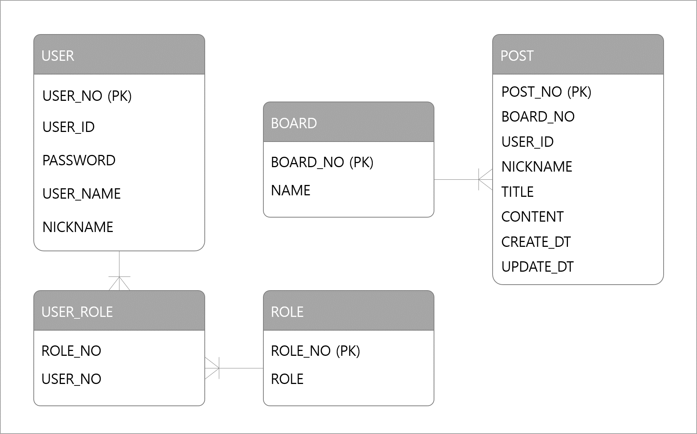
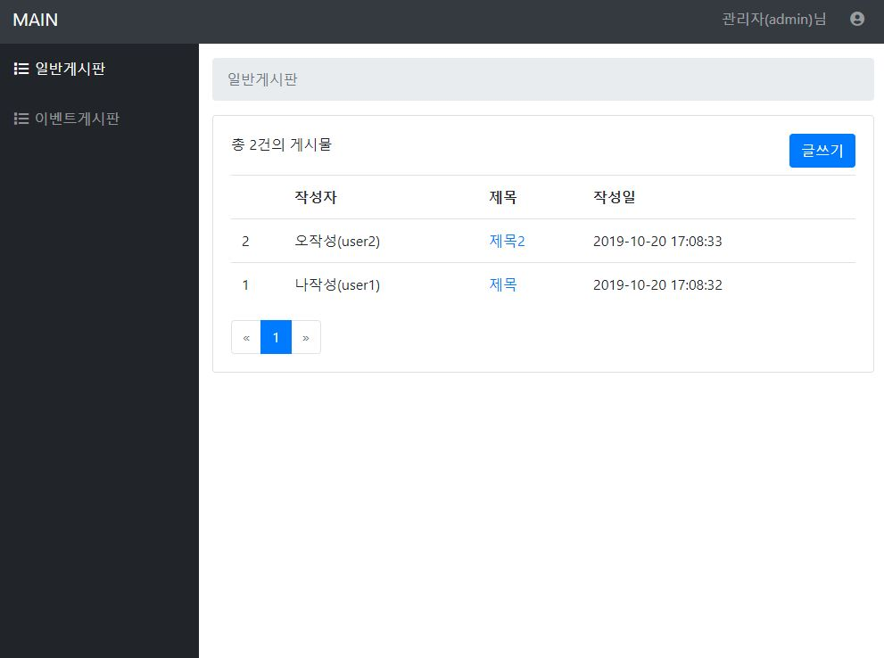
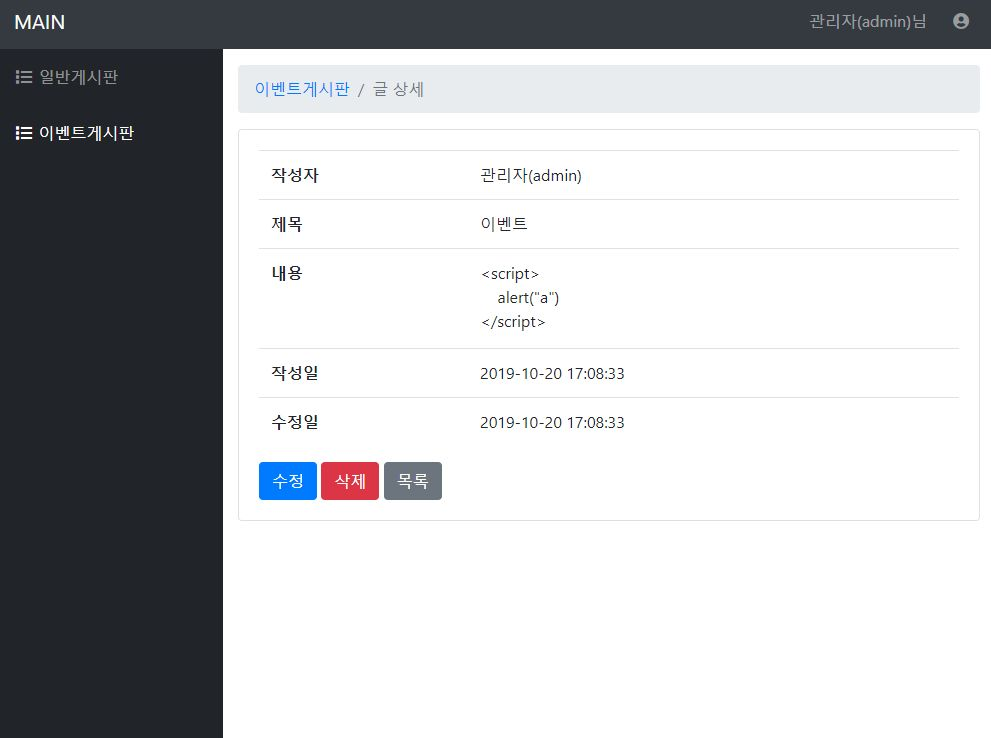
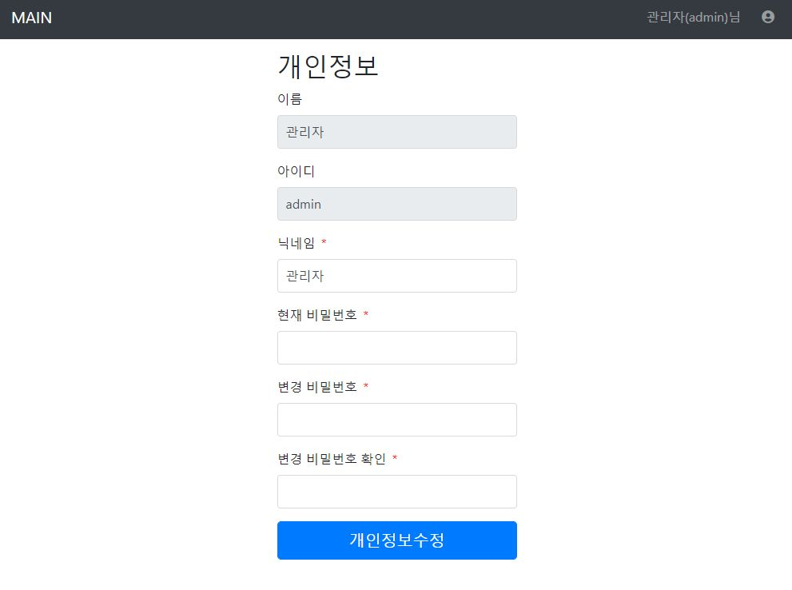
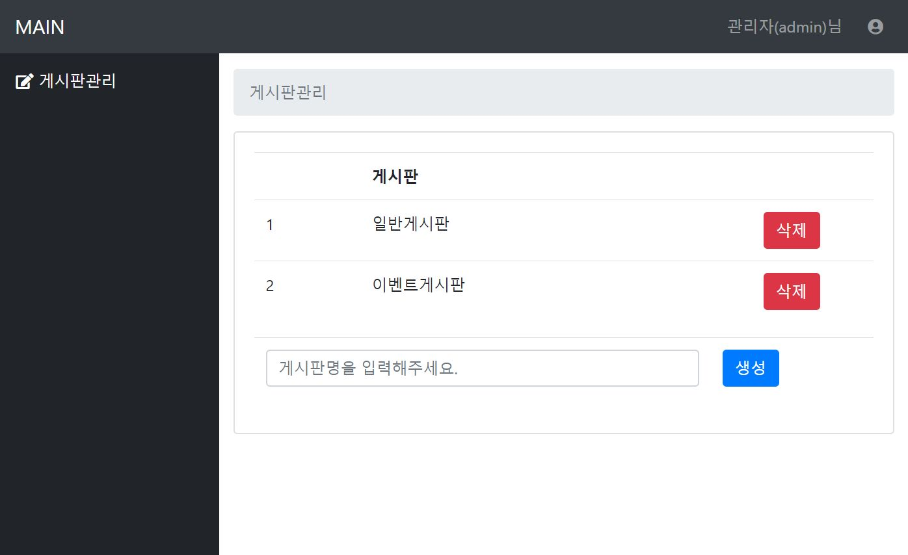

# spring-webboard
스프링부트로 구축한 기본 사이트
<br/><br/>
## SKILL
* 개발도구 : IntelliJ
* Java : jdk 1.8
* Framework : SpringBoot 2.1.x
* Build : Gradle 5.6.x
* DB : H2
* mybatis
* Front-end : jsp, [bootstrap admin](https://startbootstrap.com/templates/sb-admin/)
<br/><br/>

## BUILD
처음에 jar 파일로 빌드해서 실행을 했었는데, jsp 경로를 찾지 못했다.<br/>
경로를 바꿔보고 삽질을 한 결과, springboot가 jar로 된 빌드 파일은 더이상 jsp를 지원하지 않는다고 한다.
[상세](https://blog.naver.com/myh814/221683685426) <br/>
> ### 임시 접속
>> AWS 서버 running중인 경우 접속 가능. [사이트 접속](http://ec2-52-79-78-219.ap-northeast-2.compute.amazonaws.com:8080/)
> ### 실행방법 1
>> 1. [spring-webboard-0.0.1-SNAPSHOT.war](spring-webboard-0.0.1-SNAPSHOT.war)을 다운받는다.
>> 2. 터미널에서 `java -jar spring-webboard-0.0.1-SNAPSHOT.war` 을 실행한다.
>> 3. `http://localhost:8080`으로 접속한다.
> ### 실행방법 2
>> 1. [git파일](https://github.com/moonsiri/spring-webboard)을 다운받는다.
>> 2. 개발툴에 import 하여 실행한다.
> ### 실행방법 3
>> 1. [git파일](https://github.com/moonsiri/spring-webboard)을 다운받는다.
>> 2. [build.gradle](build.gradle) 파일에서 `// war로 빌드 시` 부분의 주석을 제거한다.
>> 3. war로 빌드 후 실행한다.

<br/>
<hr/>
<br/>

## [ERD](src/main/resources/schema.sql)


#### [USER](src/main/resources/data.sql)
|ROLE|USER_ID|PASSWORD|
|---|---|---|
|ADMIN|admin|1234|
|USER|user1|1234|
|USER|user2|1234|
|USER|user3|1234|
|USER|user4|1234|
|USER|user5|1234|
|USER|user6|1234|
<br/>

## REST API
|ROLE|ACTION|URI|Method|
|---|---|---|---|
|Anonymous|메인 페이지|/|GET|
|Anonymous|로그인|/login|GET|
|Anonymous|Password 찾기 화면|/pw|GET|
|Anonymous|Password 찾기|/pw|POST|
|Anonymous|게시글 목록 화면|/board/{boardNo}|GET|
|Anonymous|게시글 상세 화면|/board/{boardNo}/{postNo}|GET|
|USER|게시글 작성 화면|/board/{boardNo}/post|GET|
|USER|게시글 작성|/board/{boardNo}/post|POST|
|USER|게시글 수정 화면|/board/{boardNo}/post/{postNo}|GET|
|USER|게시글 수정|/board/{boardNo}/post/{postNo}|PUT|
|USER|게시글 삭제|/board/{boardNo}/post/{postNo}|DELETE|
|USER|사용자 페이지|/user|GET|
|USER|사용자 정보 수정|/user|POST|
|ADMIN|관리자 페이지|/admin|GET|
|ADMIN|게시판 관리 화면|/admin/board|GET|
|ADMIN|게시판 생성|/admin/board/{boardNo}|POST|
|ADMIN|게시판 삭제|/admin/board/{boardNo}|DELETE|

#### 게시글 목록 화면


#### 게시글 상세 화면


#### 사용자 페이지 - 사용자 정보 수정


#### 관리자페이지 - 게시판 관리 화면


<br/>

## [Spring Security](src/main/java/com/demo/webboard/config/security)
```java
@EnableWebSecurity
@Configuration
public class WebSecurityConfiguration extends WebSecurityConfigurerAdapter {
    // ...
    @Override
    protected void configure(HttpSecurity httpSecurity) throws Exception {
        httpSecurity
            .authorizeRequests()    // 권한요청 처리 설정 메서드
                .antMatchers("/board/**/post/**").hasAnyRole("USER", "ADMIN")    // post CUD 권한은 ROLE_USER에게만 존재
                .antMatchers("/user/**").hasAnyRole("USER", "ADMIN")   // 사용자 페이지는 ROLE_USER에게만 존재
                .antMatchers("/admin/**").hasRole("ADMIN")   // 관리자 페이지는 ROLE_ADMIN에게만 존재
                .anyRequest().permitAll()   // 다른 요청은 누구든지 접근 가능
                .and()
            .formLogin()
                .loginPage("/login").permitAll()    // 로그인 기본 url
                .loginProcessingUrl("/login")
                .successHandler(authenticationSuccessHandler)
                .and()
            .logout()
                .logoutSuccessUrl("/").permitAll()
                .and()
            .csrf()
                .ignoringAntMatchers("/h2-console/**")
                .disable(); // GET메소드는 문제가 없는데 POST메소드만 안되서 CSRF 비활성화 시킴
    }
    // ...
}
```
#### [Password Encoding](src/main/java/com/demo/webboard/config/security/WebAuthenticationProvider.java)
```
    @Bean
    public PasswordEncoder passwordEncoder() {
        return new BCryptPasswordEncoder();
    }
```
#### Find Password - [Create temporary password](src/main/java/com/demo/webboard/main/service/impl/UserServiceImpl.java)
```
    public String getRamdomPassword() {
        char[] charSet = new char[] {
                '0', '1', '2', '3', '4', '5', '6', '7', '8', '9',
                'A', 'B', 'C', 'D', 'E', 'F', 'G', 'H', 'I', 'J', 'K', 'L', 'M', 'N', 'O', 'P', 'Q', 'R', 'S', 'T', 'U', 'V', 'W', 'X', 'Y', 'Z',
                'a','b','c','d','e','f','g','h','i','j','k','l','m','n','o','p','q','r','s','t','u','v','w','x','y','z',
                '!','@','#','$','%','^','&' };

        StringBuffer sb = new StringBuffer();

        int idx = 0;
        int len = charSet.length;
        for (int i=0; i<10; i++) {
            idx = (int) (len * Math.random());
            sb.append(charSet[idx]);
        }

        return sb.toString();
    }
```


## ParameterMap Setting
`mybatis`를 사용하면서 `parameterType`과 `resultType`으로 `Map`을 사용하였는데 `key`값이 대문자로 저장이 됐다.<br/>
전자정부프레임워크(egovFramework)에서는 `EgovMap`가 처리해줬지만 spring엔 제공하는 라이브러리가 없다.<br/>
`key`값을 대문자에서 소문자로 변경하는 방법은 몇가지가 있지만 전자정부프레임워크 방법을 선택했다.<br/>

[ParamMap.java](src/main/java/com/demo/webboard/util/ParamMap.java)
```
public class ParamMap extends ListOrderedMap {
    // ...

    public Object put(Object key, Object value) {
        // StringUtils.lowerCase 로 key값을 소문자로 변경 (USER_NAME => user_name)
        // JdbcUtils.convertUnderscoreNameToPropertyName 로 key값을 camelCase로 변경 (user_name => userName)
        return super.put(JdbcUtils.convertUnderscoreNameToPropertyName(StringUtils.lowerCase((String) key)), value);
    }
}
```
application.yml
```
mybatis:
  mapper-locations: classpath*:mapper/*.xml
  type-aliases-package: com.demo.webboard.util
```
mapper/*.xml
```
<select id="selectPostList" parameterType="ParamMap" resultType="ParamMap">
    ...
</select>
```

## Transaction
[DefaultTransactionManager.java](src/main/java/com/demo/webboard/util/DefaultTransactionManager.java)
```
@Service
@Scope("prototype")
public class DefaultTransactionManager extends DefaultTransactionDefinition {

    @Autowired
    PlatformTransactionManager transactionManager;

    // ...
```
extends [CmmnAbstractServiceImpl](src/main/java/com/demo/webboard/util/CmmnAbstractServiceImpl.java)
```
@Service
@Transactional
public class BoardServiceImpl extends CmmnAbstractServiceImpl {
    // ...
    @Override
    public int deleteBoardMap(long boardNo) {
        DefaultTransactionManager tx = getTransactionManager(); // 트랜잭션 처리
        tx.start();

        int result;
        try {
            Map<String, Object> paramsMap = new HashMap<>();
            paramsMap.put("boardNo", boardNo);
            boardMapper.deletePostMap(paramsMap);
            result = boardMapper.deleteBoardMap(paramsMap);
        } catch (Exception e) {
            result = -1;
            tx.rollback();
        }
        tx.commit();
        tx.end();
        return result;
    }
```

## Paging
[Paging.java](src/main/java/com/demo/webboard/util/Paging.java)
```
public class Paging {
    /**
     * totalCount   : 게시 글 전체 수
     * pageSize     : 한 페이지의 게시 글 수
     * navSize      : 한단락 크기 (페이징 네비 크기)
     * firstPageNo  : 첫 번째 페이지 번호
     * prevPageNo   : 이전 페이지 번호
     * startPageNo  : 시작 페이지 (페이징 네비 기준)
     * pageNo       : 페이지 번호
     * endPageNo    : 끝 페이지 (페이징 네비 기준)
     * nextPageNo   : 다음 페이지 번호
     * finalPageNo  : 마지막 페이지 번호
     *
     * @param paramsMap
     * @return
     */
    public static Map<String, Object> makePaging(Map<String, Object> paramsMap) {
        // ...
```
Controller
```
        paramsMap.put("totalCount", totalCount);
        paramsMap.put("url", url);
        paramsMap.put("pageNo", pageNo);
        Paging.makePaging(paramsMap);
        // select list
        paramsMap.put("list", list);
```
include [paging.jsp](src/main/webapp/WEB-INF/view/include/paging.jsp)
```
    <%@ include file="/WEB-INF/view/include/paging.jsp" %>
```
